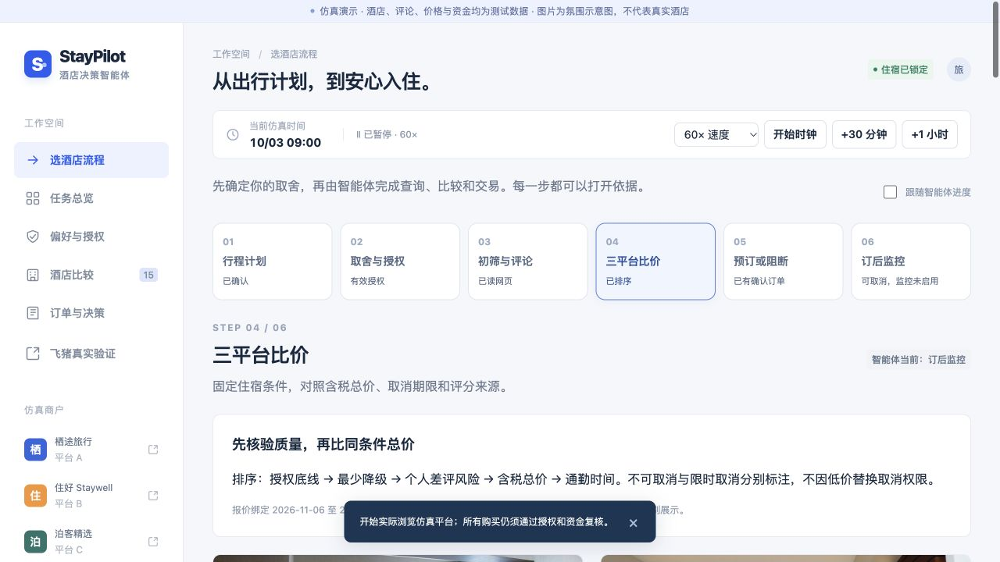

# StayPilot 三平台酒店自主预订仿真

三个独立酒店商户网页与一个智能体控制台。智能体实际操作网页读取酒店、评论和当前报价，再在用户确认的预算与条件内预订；可退款时继续比较竞品并先订新、后退旧。

**主交易演示使用仿真酒店、评论、订单、测试资金与退款；图片为氛围示意。另有独立的飞猪真实只读页面，已经调用官方 FlyAI 搜索并核验一个酒店的网页证据。真实订单与支付未启用。**

开发与评审依据见 [比赛开发手册](docs/competition-development-handbook.md)。个人订酒店流程的最新实现及真实模型、高德验证见 [流程更新说明](docs/personal-workflow-update.md)。控制台默认进入六步流程：行程计划 → 取舍与授权 → 初筛与评论 → 三平台比价 → 预订或阻断 → 订后监控。每步对应独立界面，状态来自运行阶段、候选证据、排序记录及订单，不以任意浏览次数冒充全部完成。

最新交付材料：[3 分钟实际网页演示](docs/demo-3min.webm)、[可编辑 Pitch Deck v2](docs/pitch-deck-v2.pptx)、[验收对应表](docs/acceptance.md)、[同市场操作路线对照](docs/benchmark.md)。视频包含六步界面、测试交易与真实飞猪只读查询；前一版 Deck 保留作历史材料。



## 本地运行

需要 Node.js 24 或更新版本，以及 Google Chrome。其他 Chromium 浏览器通过 `CHROME_PATH` 配置。

```bash
npm ci
npm run dev
```

打开 http://localhost:4173。控制台侧栏可打开三个平台。每个浏览会话拥有独立的测试钱包与 SQLite 数据，不需要真实账号或银行卡。

生产模式：

```bash
npm run build
npm start
```

## 两分钟体验

1. 默认「选酒店流程」先保存行程草稿，再进入取舍与授权。也可通过「偏好与授权」一次编辑完整授权单。默认预算与测试余额均为 ¥1,000，不允许不可取消房，卫生／隔音／气味与有窗为底线。勾选授权确认，再点击「确认授权并保存」。
2. 在第三步点击「开始自动选酒店」，或回到「任务总览」点击「启动一次决策」。查看浏览截图与评论依据：平台 C 的低价不可取消房被排除，平台 A 湖畔时光酒店 ¥455 被预订。
3. 点击「+30 分钟」，再次执行决策。平台 B 云栖湖滨酒店降为 ¥315，满足净省 ¥50 且 5% 的门槛，先确认新单再取消旧单。
4. 此时占款为 ¥770，可用余额 ¥230，原单退款尚未到账。再推进至少15分钟，¥455退款到账后，可用余额变为 ¥685。
5. 查看「订单与决策」，打开截图、评论和结构化依据，导出可验证哈希链的完整日志。

以上金额来自可复现种子场景，不是市场收益统计。开启持续监控后，智能体每30仿真分钟检查一次；首次截止前1分钟额外执行最终核验。浏览决策执行期间暂停仿真时钟，防止加速市场使整个浏览回合的报价立即过期；实际执行耗时仍单独记录。

## 偏好与决策

- 用户确认目的地、日期、人数、房型、总预算、临时占款上限、首次截止、订后优化期限、硬底线与逐级降级顺序。窗型可设为必须有窗、有窗优先或均可接受；只有将无窗加入授权降级顺序，才可放宽有窗优先，硬底线始终有效。
- 自然语言提取只生成待检查草稿，不能直接授权。默认离线规则驱动；可选模型辅助模式见下文。
- 评论分析保留平台、日期、原文、正反证据、问题频率和用户权重。低评分不自动等于不适合；没有证据也不等于没有问题。
- 同一住宿条件下对比含税总价和取消政策；平台原始评分尺度与总评论数量保留。不同取消政策分别呈现。
- 候选按授权档位、个人差评风险、价格、通勤排序。候选页解释入选与排除原因。
- 截止无解时，基于已观察报价给出最多三组条件建议；过期价格需重新核验，超出授权的调整必须由用户确认。

## 真实酒店与统一 MCP

打开 http://localhost:4173/live/fliggy。服务端配置 `FLYAI_API_KEY` 后调用官方 CLI，显示真实搜索价格、观察时间、图片及详情链接；每30真实分钟查询一次，最多24小时，截止自动停止。当前需要电脑与本机服务运行，重启后须重新启用；真实监控与仿真时钟分开。

真实搜索价不绑定最终含税总价、房型库存、人数、餐食与取消政策。已浏览的汉庭黄龙文三路评论和房型是2026-10-04历史证据，保留网页/API评分冲突、老样本和正面反证；不代表所有酒店已核验。真实下单返回实际阻断，不扣仿真钱包、不创建真实订单。

`npm run mcp` 提供本机 stdio 工具 `search_hotels`、`get_hotel_details`、`get_live_price`、`book_hotel`。最后一个仅演示阻断，不是成交接口。`npm run test:mcp` 会进行一次真实查询并核验协议，需要配置 FlyAI 凭证。

Booking 官方 MCP 工具发现连接器已编写，等待 Managed Affiliate 凭证；Expedia、Agoda 尚未实现业务适配器。参考 PDF 中的 RollingGo 已做匿名连接探测，401；仍需对应 Key，不能用 FlyAI Key 代替。详细申请事项见 [接入清单](docs/provider-onboarding.md)，真实验证见 [实测报告](docs/flyai-real-verification.md)。本机密钥放在被 Git 忽略的 `.env`，不要写入截图或命令参数。

## 资金与失败保护

钱包、住宿预算及临时占款上限分别审核；授权不会生成余额，退款请求不等于到账。正常取消原住宿必须已有新订单。不可取消房需单独授权，购买后停止换订。取消边界采用绝对上海时区时间，达到截止即不可退款。

交易执行时复核授权版本／撤销／到期、当前报价、库存、预算、余额和占款。订单及退款幂等，避免重复扣款。旧单取消失败会尝试取消新单；状态不确定、补偿或退款异常时冻结后续购买并展示实际订单。撤销不会自动取消现有住宿，已开始交易仍可进行必要补偿。

## 模型辅助配置

复制 `.env.example` 为 `.env`，填入支持 Chat Completions JSON 格式的服务：

```dotenv
LLM_BASE_URL=https://api.stepfun.com/step_plan/v1
LLM_API_KEY=你的服务端密钥
LLM_MODEL=step-3.5-flash
AMAP_WEB_SERVICE_KEY=你的高德Web服务密钥
```

本次已实际验证Step Plan的模型列表、偏好提取及评论原文分析。高德地址解析、POI查找、步行和公共交通规划也已实际验证；真实验证页先确认两个位置，再显示路线与换乘，当前路线不保证未来入住日班次。其他支持Chat Completions JSON的服务仍可通过LLM_*配置。

重启后可调用偏好提取与模型辅助评论分析。模型输出必须经过字段、类别及原文摘录校验，付款权限由确定性后端执行。未配置模型时显示「规则驱动」，完整仿真流程仍可使用。密钥仅在服务端读取，不进入前端、日志或代码仓库。

## 测试与演示场景

```bash
npm test
# 另一个终端先启动服务，再运行真实浏览器集成测试
npm run test:e2e
npm run test:deadline
```

场景包括跨平台比价与换订、税费超额、售罄、截止无解、取消失败、退款延迟／失败及评论越权指令。38 项单元测试、9 项实际仿真网页浏览器验收与 6 项截止边界集成核验通过。结果见 `docs/browser-verification.json` 与 `docs/deadline-verification.json`。

服务运行时执行 `npm run benchmark` 可重现传统操作路线与智能体的同市场对照。`docs/benchmark.md` 明确记录步骤、自动化执行耗时、资金与订单成本；传统路线为浏览器自动化回放，耗时不能作为真实人工用户实验结论。

执行 `npx playwright install ffmpeg` 后可用 `npm run record:demo` 重录带字幕的网页演示。最新录制使用用户调整的降级顺序（先开业年份、再距离），先订 ¥455 后换订 ¥315，并调用一次真实 FlyAI 查询；需服务端配置相应凭证。文件在结尾静止画面处裁至 3 分钟，关键交互段均保留。

## 部署与数据

本项目依赖 Node.js、SQLite 和可启动的浏览器进程，不能作为纯静态网页部署。Dockerfile 提供容器部署入口：

```bash
docker build -t staypilot .
docker run --rm -p 4173:4173 -v staypilot-data:/app/data staypilot
```

Docker 部署模板未在当前机器运行验证。公开服务器应保留持久化卷，并按部署地址设置 `PUBLIC_ORIGIN`。访客使用随机 HttpOnly 会话 Cookie 隔离数据；这不是面向真实资金的生产身份认证系统。

数据保存在 `data/`；浏览证据保存在 `public/evidence/`，服务器仅向所属会话开放。二者、密钥、依赖和本机缓存均不进入仓库。重置场景会清空当前会话的仿真任务和交易记录。

## 第三方来源

React、Vite、TypeScript、Playwright、Node.js SQLite 和 Artifact Tool 用于实现或制作演示资料，见 `docs/credits.md`。所有应用代码在本次实现中编写，原始比赛材料保持不变。
