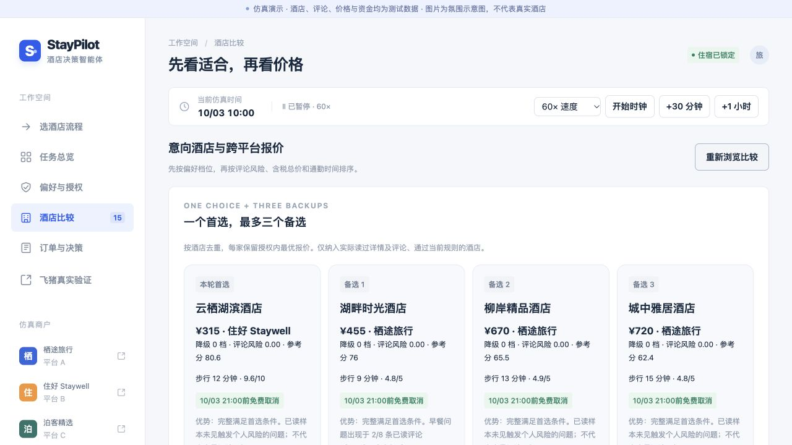
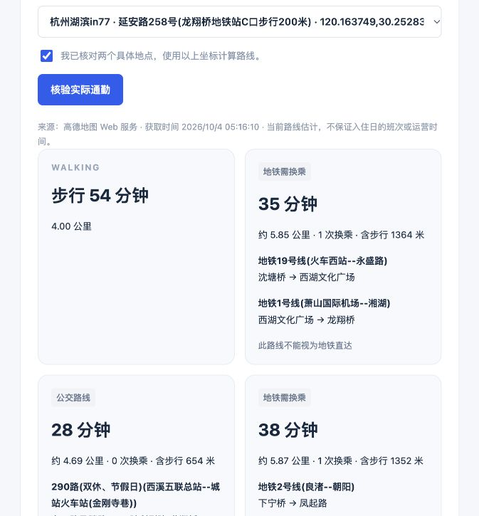

# 个人订酒店流程的实现更新

更新于2026-10-04。参考用户提供的个人订酒店流程，保留原有预算、权限、取消和资金规则；以下是已经落地并验证的变化。原始材料含私人凭证，不随公开代码发布。

## 现在的流程

行程与预算 → 人数与房型 → 设施、窗型、新旧程度与评论底线 → 平台A初筛 → 三平台核验 → 一个首选与最多三个备选 → 授权内预订或明确阻断 → 取消窗口内监控与换订。

| 用户流程 | 本次实现 |
| --- | --- |
| 洗衣、停车等设施 | 授权单新增必须设施与偏好设施；必须设施缺少网页确认即阻断，不能通过其他降级抵消。偏好设施计入参考分，不自动改变原有排序规则。 |
| 开业与翻新 | 可选择按开业、按翻新、或接受近期开业／翻新；保存和确认口径后才生效。分别保留原始年份，不把两种事实混为一谈。相关年份未知仍排除。 |
| 一个最佳、三个备选 | 按酒店去重，每家保留授权内最优报价。最多四家合格候选，不以排除的酒店补足；每家展示价格、档位、评论风险、取消条款和代价。 |
| 量化比较 | 新增可展开的匹配参考分与计算公式，实际成交排序仍为硬规则、档位、个人差评风险、含税价格、通勤。高参考分不能覆盖硬底线或取消权限。 |
| 无解时提高预算或降低软条件 | 一轮完整核验无解后立即给出最多三套条件组合，并提供“调整预算”及“调整软条件”两个入口。任何条件变更都须重新确认；不修改钱包、原预算或首次截止。 |
| 订后监控当前与备选 | 界面列出当前住宿和本轮最多三个备选。每30仿真分钟复查已订酒店与候选，并发现新候选；换订继续核验档位、风险、净节省、余额、占款、退款与取消窗口。 |

仿真目录中未列出的设施，表示本次没有确认其提供，不能推断酒店一定没有该设施。实时平台房型、设施和完整评论尚未核验，不能套用仿真目录的满足结论。

## 参考分的公开规则

每项先计算0—100分，然后加权。公式对照代码 `shared/workflow.ts` 与候选卡上的展开说明：

- 预算余量40%：`100 × (1 − 含税总价 / 住宿预算)`，限制在0—100。
- 通勤20%：`100 − 已知通勤分钟 / 60 × 100`，限制在0—100；符合步行要求时采用步行，否则已确认地铁直达时采用地铁时间。
- 平台评分20%：`平台分数 / 平台满分 × 100`。仅在仿真已知尺度下使用，飞猪评分尺度未知时不生成这种参考分。
- 新旧程度10%：按用户确认的开业／翻新口径，入住年份减去已知年份，每年扣10分；未知计0分并由规则排除。
- 偏好设施10%：已确认提供的偏好设施数／所选偏好设施数。未设设施偏好时所有酒店同分，未知设施不视作提供。

评论风险单独计算并优先执行，不合入参考分来抵消差评。此分数用于解释取舍，不声称是统计预测、精确住宿质量或全平台最优。

## Step Plan模型已真实验证

服务端配置支持用户提供的Step Plan地址 `https://api.stepfun.com/step_plan/v1`，本机使用 `step-3.5-flash`。

实际验证：模型列表HTTP200；Chat Completions HTTP200；带预算、必须有窗、自助洗衣、免费停车偏好与新旧口径的描述，经过校验后返回结构化草稿。界面“理解并填入草稿”也使用这个服务。

对仿真酒店8条评论的实际模型调用，返回2条隔音证据；摘录“临街客房夜间有车辆声音，隔音一般”与对应原文连续片段一致，才被采用。这里的评论内容为仿真数据，只有模型调用是真实服务。

模型返回必须经过允许字段、金额范围、枚举、设施名称和评论原文校验。无效输出不直接进入授权；部分评论权重只合并对应字段。模型不能修改确认状态、撤销状态、版本、有效期或占款上限。提取时已有必须设施及差评底线取并集保留，模型遗漏不能移除底线；移除底线需在授权单手动修改再确认。理解结果仅填草稿，购买仍由用户确认的版本及确定性后端决定。实测一次无效JSON被拒绝，保留全部授权与资金；重试成功后，原有卫生、隔音和气味底线仍全部勾选，版本与确认状态没有改变。

## 高德地图已真实验证

使用服务端Web服务密钥；没有把JavaScript地图Key或安全密钥放进网页。功能在飞猪真实验证页中，酒店搜索结果可把地址填入通勤核验区。

1. 查找酒店地址与具体目的地，显示POI和地址解析的多个匹配位置。
2. 人工选择与实际酒店、目的地一致的两个位置，并勾选确认。
3. 才调用步行和公共交通规划；显示来源、获取时间、线路、站点、步行接驳与换乘次数。
4. 只有一个已识别的地铁线路且没有其他交通方式时，标记“地铁直达”。公交、地铁换乘、混合或未知类型都不视作直达。失败结果不当作0分钟。

2026-10-04 05:16上海时间的界面验证：汉庭酒店（杭州浙大西溪校区文三路店），文三路168号的酒店POI → 杭州湖滨in77，延安路258号。步行约4公里、54分钟；返回地铁19号线转1号线方案35分钟，公交290路方案28分钟，以及地铁2号线转1号线方案38分钟。两个地铁方案均需要换乘，公交不能冒充地铁直达。

地址解析还返回了文三路222号；目的地解析还返回了滨江银泰。用户确认位置这一关用于避免自动采用错误坐标。酒店POI的现用名称与飞猪搜索名称不同，也应保留核对。

路线是当前获取的估计，特别是带“双休、节假日”标签的公交，不能据此保证11月入住日的班次或运营。请求缓存15分钟，并保留实际获取时间；不把缓存读取时间伪装成新观察。

对应官方接口说明：[高德路径规划](https://lbs.amap.com/api/webservice/guide/api/direction)。

## 验证与边界

- `npm run build`成功。
- `npm test`：38项全部通过，新增设施实际支付阻断、新旧口径、跨平台去重、提前无解但截止仍停止、模型越权字段过滤、原文校验和交通分类检查。
- `npm run test:e2e`：9项全部通过，包括实际浏览三平台、预订、先订新后退旧、退款占款、税费阻断、撤销、不可取消权限及手机布局。
- `npm run test:deadline`：6项全部通过，包括截止前1分钟最后核验、截止停止、基于网页证据的条件组合以及截止后实际支付阻断。
- 浏览器人工操作已核验：真实地图位置选择和路线结果；模型生成待确认偏好；首选加三个备选与参考分。

真实酒店搜索、地图查询和模型调用已接通。飞猪最终含税房型报价、库存、餐食和正式订单／退款接口仍需补齐官方能力与授权；当前真实成交入口实际阻断，不创建真实订单。订后目标为授权与取消期限内优化已观察的成本，不能承诺未来市场的最低价。
