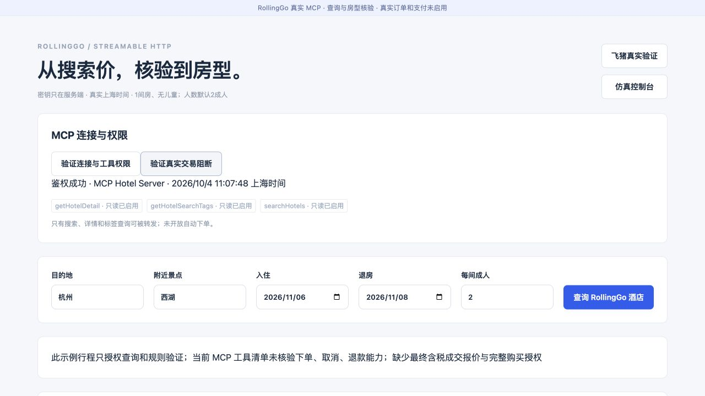
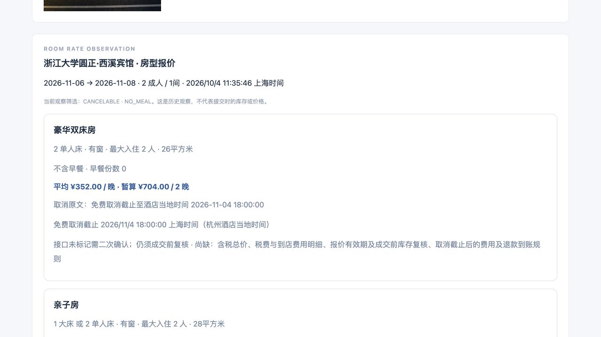

# RollingGo MCP 真实接入验证

核验日期：2026-10-04，上海时间。行程为用户已确认的查询示例：杭州西湖附近，2026-11-06 至 11-08，默认2成人、1间房、无儿童。未创建真实订单或付款。

## 实际完成的调用

使用用户提供的 RollingGo 专属 Key，通过 Streamable HTTP 连接 `https://mcp.rollinggo.cn/mcp`；Bearer 请求头仅由后端构造。凭证存于被 Git 忽略、权限600的本机 `.env`，前端和公开交付不包含密钥。

初始化与鉴权成功，返回服务 `MCP Hotel Server / 1.0.0`。实际 `tools/list` 返回：

- `searchHotels`：已实际返回5家杭州酒店。
- `getHotelDetail`：已实际返回指定酒店的3个房型、平均每晚价、餐食、窗型、最大入住人数和取消原文。
- `getHotelSearchTags`：已实际获得搜索标签元数据。

当前工具清单没有下单、取消或退款工具。不能把官网功能描述当成本账号已获得的交易能力。此处查询不需要再登录消费者账号；将来如要交易，需要平台开放相应接口，并另行取得真实购买授权。

## 可核验实例

[机器验证记录](rollinggo-verification.json)保存统一 MCP 的实际查询时间和结果摘要。2026-10-04 11:09上海时间，圆正·西溪宾馆（RollingGo ID 499437）返回：

| 房型 | 平均每晚价 | 两晚暂算价 | 餐食 | 取消原文 |
| --- | --- | --- | --- | --- |
| 豪华双床房 | CNY 352 | CNY 704 | 不含早餐 | 免费取消截止至酒店当地时间 2026-11-04 18:00:00 |
| 亲子房 | CNY 383 | CNY 766 | 不含早餐 | 同上 |
| 豪华行政房 | CNY 612 | CNY 1224 | 不含早餐 | 同上 |

杭州取消截止对应 `2026-11-04T18:00:00+08:00`。返回没有明确的含税总价、税费和到店费用明细；“平均价×晚数”始终标记暂算价，不是已核验成交价。取消截止后费用和退款到账规则也缺失。不可取消布尔值本身不足以推出“不可退款”，应用要求取消原文证据。其他城市的酒店当地时区未核验时不直接套用上海时间。

住客评分、评论数量和原文、开业与翻新时间没有在此次返回中确认。酒店星级不是住客评分；名称与其他平台相同也不足以建立跨平台酒店映射。不能据此声称已完成完整酒店推荐或满足全部用户偏好。

## 应用接入

本机 [RollingGo 核验页](http://localhost:4173/live/rollinggo)可验证连接、搜索、筛选餐食及取消条款、核验房型、查看观察记录，并将酒店地址交给现有高德核验组件。飞猪仍保留为主平台，两者各自保存酒店ID，不自动混用。

HTTP接口：`POST /api/live/rollinggo/discover`、`search`、`detail`、`tags`；`GET /api/live/rollinggo/state`读取持久化历史；`POST /api/live/rollinggo/book`实际返回403和`orderCreated:false`。只读调用白名单禁止转发任何未来新增的交易工具。

统一 stdio MCP 保留4个工具，在 `search_hotels`、`get_hotel_details`和`get_live_price`传入 `provider: "rollinggo"`即可选择此数据源。详情和价格核验须带本次日期、人数与RollingGo整数ID；`book_hotel`无论数据源均只返回阻断。飞猪为默认数据源，原有行为保持。

RollingGo首版每次为手动查询，保存SQLite历史；新增页面没有自动开启持续盯价，现有飞猪每30分钟只读监控保持独立。未修改Codex全局连接配置，也未安装教程脚本。实际协议联调使用项目已有官方MCP SDK。

## 验证

构建、45项单元测试及9项网页验收通过。`npm run test:rollinggo`通过真实统一MCP搜索、房型查询和交易阻断；还验证无效人数先被拦截。新增测试覆盖报价酒店/日期冲突、价格单位、评分与星级区分、餐食及取消政策本地复核、未知时区、业务错误、工具白名单和观察持久化。

真实网页完成鉴权、酒店搜索、选择可取消及不含早餐筛选、房型核验和下单阻断。一次详情请求未完成，页面保留失败且没有新报价；重试后于11:35上海时间成功，历史失败记录仍可核对。请求采用90秒网络超时及95秒工具超时，不把失败转成成功观察。

官方来源：[RollingGo 开源仓库](https://github.com/RollingGo-AI/rollinggo-hotel-mcp)。服务当前schema和实际返回优先于教程及宣传页。
